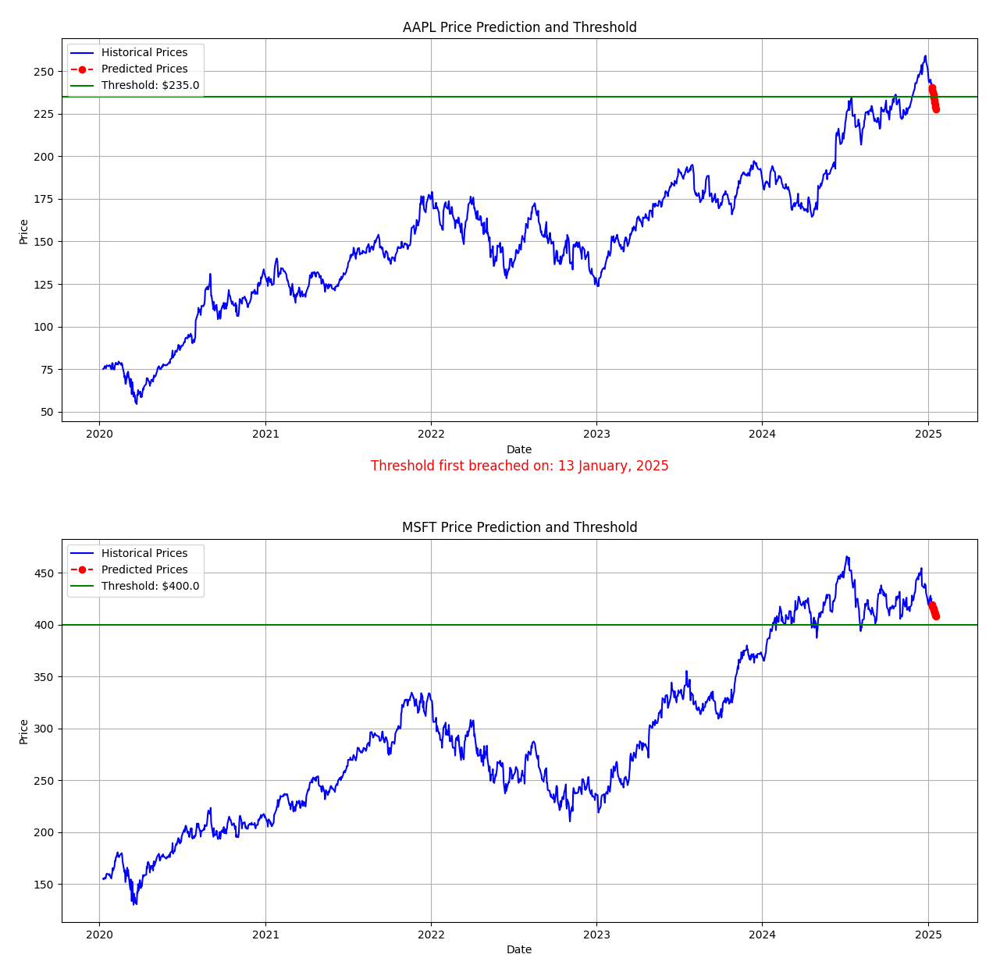
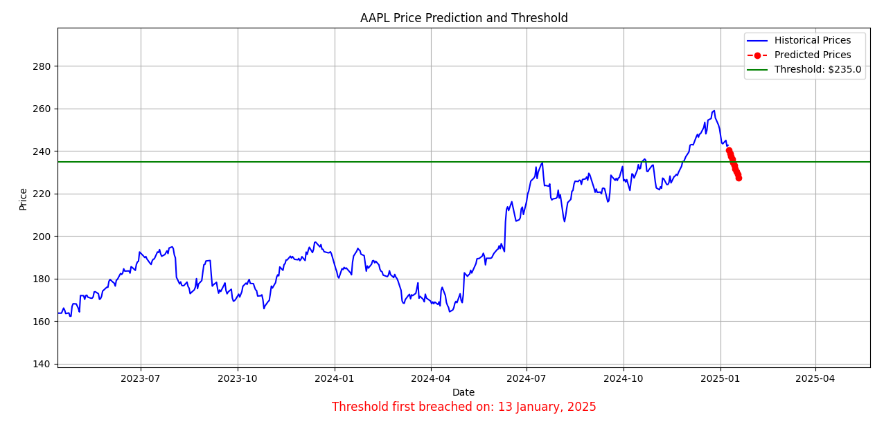

# Funds Portfolio Monitor

This project provides a tool to monitor stock portfolios, predict future stock prices using LSTM (Long Short-Term Memory) models, and send alerts if the predicted prices breach a user-defined threshold. In addition, the project converts LSTM forecasts into a simple long/flat trading strategy and evaluates it against a buy-and-hold benchmark using standard quantitative performance metrics.

## Features
- Fetches historical stock data from Yahoo Finance using `yfinance`.
- Trains an LSTM model to predict future stock prices.
- Allows users to set thresholds for price predictions.
- Provides alert notifications for when the threshold is breached.
- Visualizes historical data, predictions, and alerts with interactive plots.
- Backtests an LSTM-based trading strategy on a held-out test set and compares it to a buy-and-hold baseline using:
  - Mean Squared Error (MSE) and Mean Absolute Error (MAE)
  - Directional accuracy (hit rate)
  - Cumulative return
  - Sharpe ratio
  - Maximum drawdown

## Installation

### 1. Clone the Repository
```bash
git clone https://github.com/your-username/funds-portfolio-monitor.git
cd funds-portfolio-monitor
```

### 2. Install Dependencies
```bash
pip install -r requirements.txt
```

Main dependencies include:
- numpy
- pandas
- matplotlib
- yfinance
- scikit-learn
- tensorflow

## Usage

### 1. Run the Program
```bash
python main.py
```

### 2. Input Stock Tickers and Thresholds
The program will prompt you to input the stock tickers you want to monitor (comma-separated).  
You will also be asked to define a threshold price for each ticker.  
These thresholds are used only for alerting and visualisation.

### 3. View Results
Once the program finishes running, you will see:

- Stock graphs showing historical prices, 10-day LSTM predictions, and threshold lines.
- Alert messages if predicted prices breach user-defined thresholds.
- A terminal table summarising the backtest performance of the LSTM-based strategy versus buy-and-hold.

## LSTM Trading Strategy & Backtesting

For each ticker, the following procedure is applied:

1. Train an LSTM model on approximately five years of daily closing prices.
2. Generate one-day-ahead price forecasts on a held-out test set.
3. Convert price forecasts into predicted next-day returns.
4. Apply a simple long/flat trading rule (θ = 0.0):
   - Go long if predicted return > 0
   - Stay in cash otherwise
5. Compute daily portfolio returns and compare them to a buy-and-hold strategy on the same asset.

An example terminal output:

```text
Backtest summary (test set):
Ticker   MSE   MAE  Hit Rate  LSTM_CumRet  LSTM_Sharpe  LSTM_MaxDD  BH_CumRet  BH_Sharpe  BH_MaxDD
SPY   180.874 10.250   0.554        0.203        1.128      -0.168       0.184       0.991      -0.188
...
```

### Saving Backtest Metrics to CSV

Backtest metrics can also be saved to disk for later analysis.  
When enabled, the program writes a `backtest_results.csv` file to the project root:

```python
df_results.to_csv("backtest_results.csv", index=False)
```

## Example Output

Example inputs:
- Tickers: AAPL, MSFT
- Thresholds: 235, 400

The program produces stock price prediction graphs with thresholds and alert markers.



Zoomed view for AAPL:


